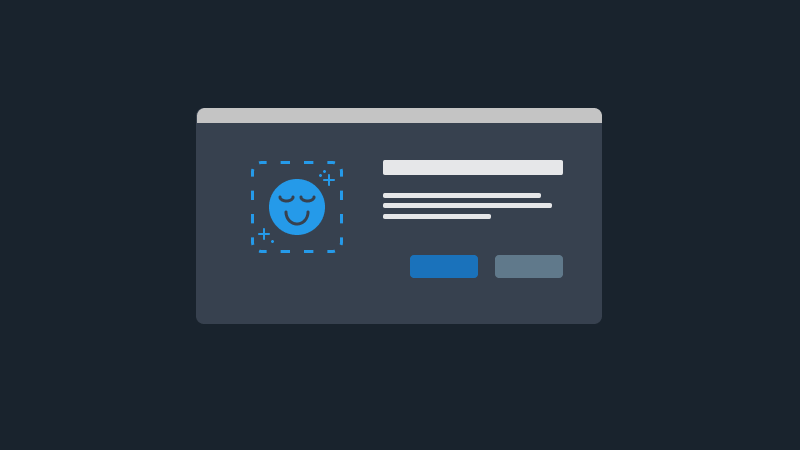
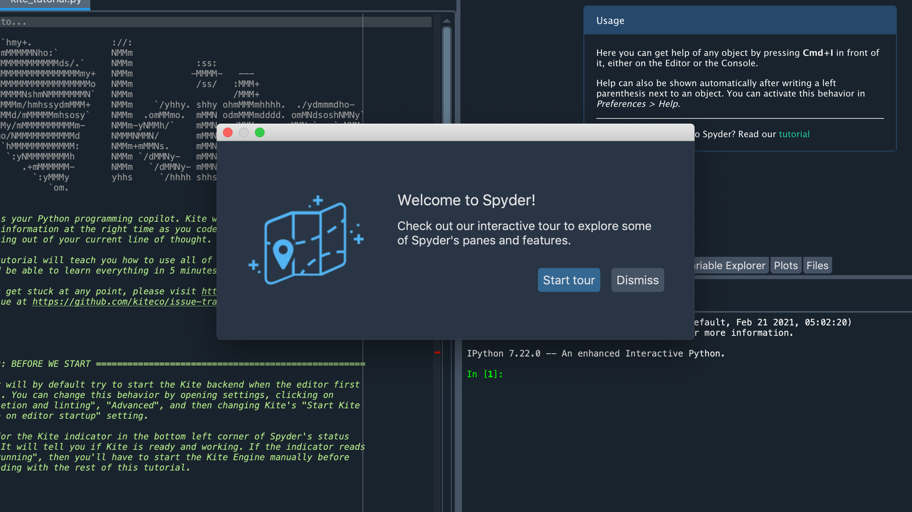
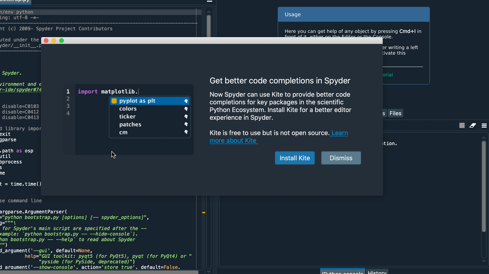
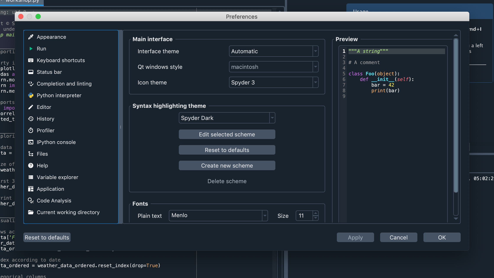
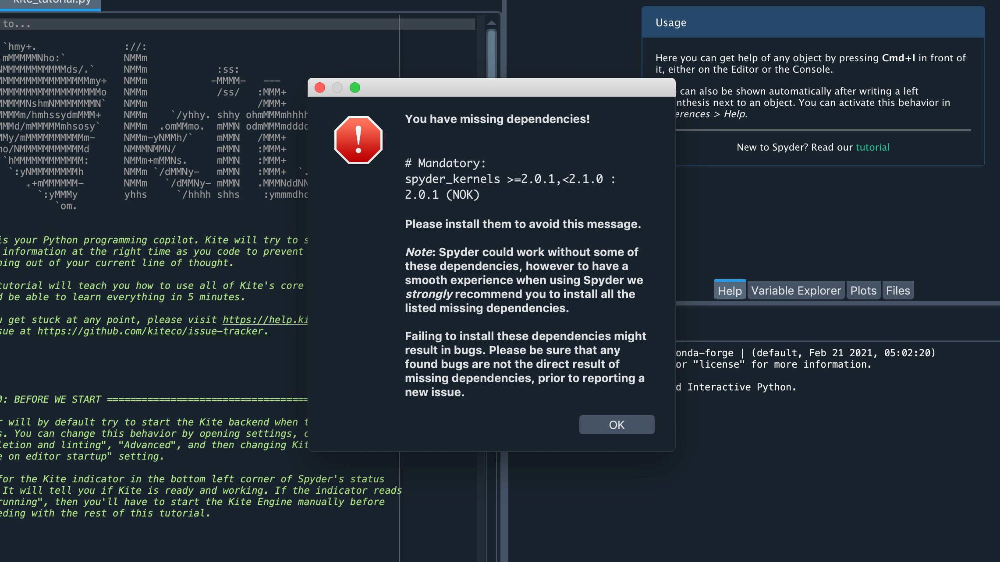
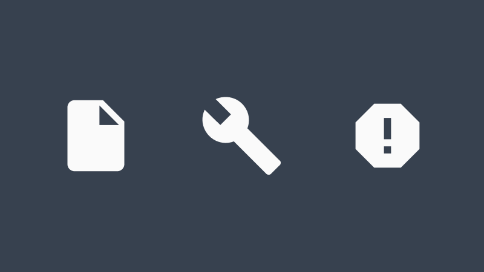
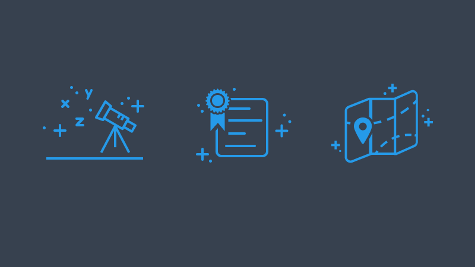
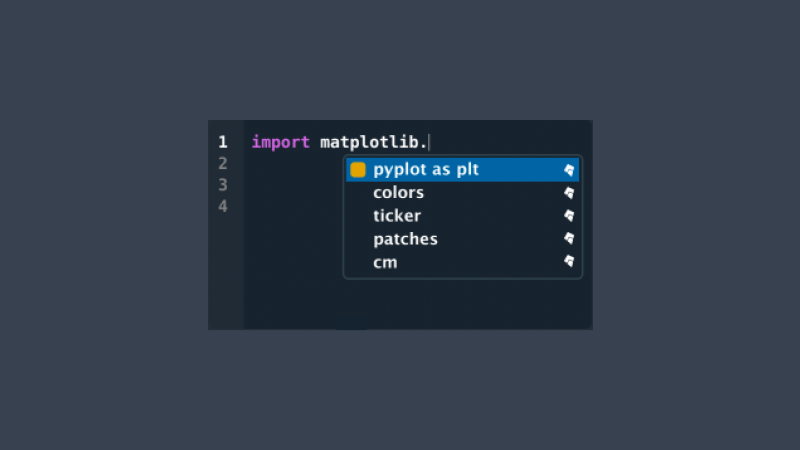

# Dialogs

## Contents
- [What is a dialog?]()
- [How should a dialog be used?]()
- [How should I design a dialog in Spyder?]()
    - [Elements of dialogs]()
    - [Types of dialogs]()
    - [Accessibility]()
    - [Image options]()
- [Details]()
    - [Colors]()
    - [Text]()
- [Example Gallery]()

## What is a dialog?

A dialog is a interface component that interrupts an experience to provide information that requires immediate user input. 
In other communities, they are also called "pop-ups" or modals.

## How should it be used?

Typically, dialogs hold information and a choice. 
They appear in their own window and sometimes even block users from interacting with the rest of the interface until they get a response.

Do use dialogs to
- Prompt a user decision that is needed before anything else can be done
- Communicate urgent information, like needing to reset the software or saving files before they close

Do *not* use dialogs to
- Communicate non-urgent information
- Advertise features
- Re-confirm a choice the user has already made

:warning: Dialogs need to be used sparingly to maintain their importance. 
Overusing dialogs is not only annoying, but it might make users get in the habit of dismissing them without review and making unintended choices.

## How should I design a dialog in Spyder?

### Elements

Required dialog elements:
- Header/title text
- Descriptive body text
- Button(s) (no less than 1, no more than 3)

Optional dialog elements:
- Image (see Image Options below)
- Checkboxes

### Types of dialogs

Spyder already has several dialogs for you to base designs off of. 

The tour dialog is a good example of a simple dialog that has and image, text, and two buttons. Whenever possible, use this style.

The Kite dialog is a good example if your dialog needs to hold more information. 
This still has the basic components, but shows how you might make space for longer dialogs when necessary.

While Spyder's Preferences is also a dialog, the complexity of it holds should not be used in standard dialogs. 
If a dialog needs that much information, it may belong as a section of the existing Preferences dialog or another menu. 
It is not recommended to create another dialog with this much content.

### Accessibility

:construction: This section is a work in progress.

Accessibility is an expected part of the contributing process. 
Please consider the following:

- Focus should be set to the dialog automatically when triggered.
- Ensure that the color contrast for text and UI elements. Using the recommended colors is a great way to start.
- Avoid using images with text. If it can't be avoided, make sure the text is available as text outside the image as well.
- Images must have descriptive text.
- Make sure your work is keyboard navigable. Typically, `tab` is to move focus between buttons, `enter` will select the focused button, and `escape` will close the dialog with the declining button option.

### Image options 

While they are not required, most dialogs in Spyder have an image that helps users quickly understand the purpose of the dialog. 
For example, error dialogs usually include a stop sign so a user can tell before reading that something is broken.

Do use images to:
- Quickly summarize a dialog's content
- Clarify a dialog's meaning
- Illustrate an action that needs to be taken

Do *not* use images to:
- Add more text to a dialog
- Be the sole source of content in a dialog
- Fill up space

You have three options for images to be included in dialogs:
- Icons
- Illustrations
- Screen shots

Icons are some of the simplest and most clear images to use in dialogs. 
Since many already exist in Spyder, this is a good first choice. 
Icons should follow the icon guidelines (Needs link). 
Do not use icons that already exist in Spyder in a way that the could conflict with their existing use.

Illustrations should follow the illustration guidelines (Needs link). 

Screen shots are best used when a dialog needs to describe something specific about an interface. 
Screen shots should be kept compact with their longest side no more than double its shortest side. 
The closer you can have the screenshot be to a square (1:1 ratio), the better.

## Details

:construction: This section is a work in progress.

Dialogs should take up less than 40% of the screen size.

Buttons align to the right of the body text box. 
Spacing between buttons is equal and consistent across dialogs.

### Colors

Color definitions can be found in the [palette.py](https://github.com/spyder-ide/spyder/blob/master/spyder/utils/palette.py) and [color-system.py](https://github.com/spyder-ide/spyder/blob/master/spyder/utils/color_system.py). 
More information can be found in the color system guide (needs link).

Background color: QDarkStyle palette `COLOR_BACKGROUND_2`

Text color: QDarkStyle palette `COLOR_TEXT_1`

Button colors:
- Confirmation buttons use QDarkStyle palette `COLOR_HIGHTLIGHT_#`. Dialogs only need this if they have information that needs to be confirmed.
- All other buttons use QDarkStyle palette `COLOR_BACKGROUND_#`

### Text

Header text size: 

Body and button text size: 

Wondering how you should write in a dialog? Visit the UX writing guide (Needs link).

Button text should be short, action-based, and directly answer the dialog's question. 
For example, if a dialog is asking users to install an update the confirmation text should be `Install` not `Ok`.

## Example Gallery

:construction: This section is a work in progress.